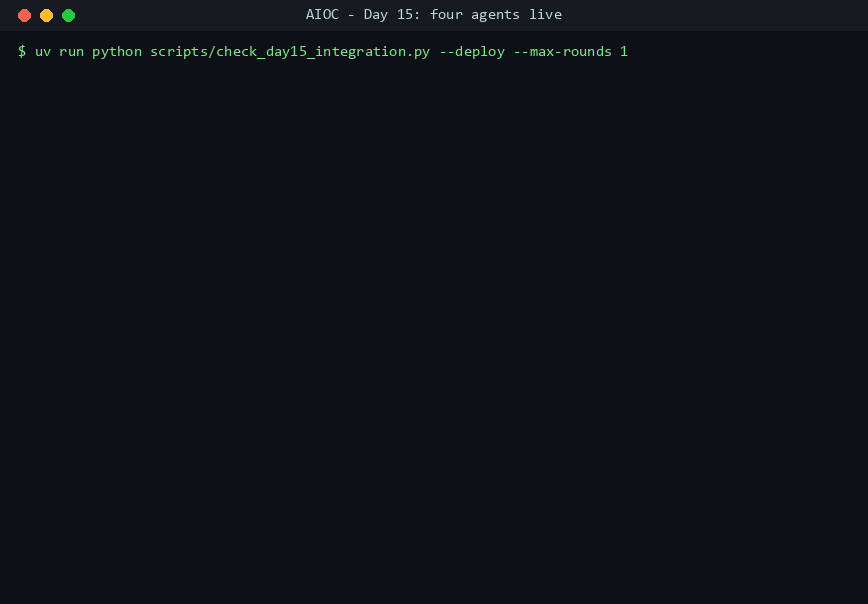

# AIOC - Enterprise AI Operations Center

A coordinator that dynamically routes operational questions to four deep subagents -
**Incident, Docs, GitHub, Deployment** - each producing schema-validated,
confidence-scored output through custom MCP tools.

> **Status: Day 19 of 30.** All four agents run live on one query. The coordinator plans
> (dynamic selection and explicit context passing enforced by validators, not prompts),
> runs independent agents in parallel and dependent ones sequentially with a bounded
> handoff digest, re-delegates resolvable gaps in a capped refinement loop, and writes a
> synthesis that is grounded in code against the agents' evidence. Six contract-named MCP
> tools run as real stdio servers with a four-class error taxonomy, and every response is
> a schema-validated `CoordinatorResponse` with measured cost and a trace id; a major
> `schema_version` mismatch is refused. A report the contract or an agent's grounding
> rules refuse is re-requested with the error attached, and the outcome is recorded.
> Every recommended production write passes a fail-closed human-in-the-loop approval gate
> whose every decision is written to an append-only audit log before it is returned.
> Every judgement in a response is read back with its band and flagged where the band
> promises more evidence than the field cites; every Docs claim traces to the retrieval
> behind it, and every unanswered sub-question to the gap that reports it.
> An eval harness scores the shipped agents against the seeded incidents' recorded truth
> (accuracy, hallucination rate, tool success, calibration), with prompt caching on and
> the Batch API as a second way to run it; it is proven offline and has no live score
> yet. The full eval run and its committed baseline are next.
> See [`EXECUTION_PLAN.md`](docs/EXECUTION_PLAN.md) for what lands when.



*The Day 15 checkpoint, replayed from the run's own transcript. A real fault is injected, the
on-call suspects the last release, and four agents show it is not the cause: the PR touched
tracing code only, the release diff is empty, and the latency originates downstream.*

---

## Start here

| Document | What it answers |
|---|---|
| [`BUILD_PLAN.md`](docs/BUILD_PLAN.md) | What we're building, and why each piece exists |
| [`EXECUTION_PLAN.md`](docs/EXECUTION_PLAN.md) | Who builds it, on which day, and how we know it's done |
| [`docs/CONTRACTS.md`](docs/CONTRACTS.md) | **Frozen.** Every data shape crossing between the two layers |
| [`docs/guides/`](docs/guides/) | How-to guides: [running the tests](docs/guides/running-tests.md), [the incidents table](docs/guides/incidents-table.md) |
| [`docs/interview-prep/`](docs/interview-prep/README.md) | War stories, decisions, and the measured numbers behind them |

`docs/CONTRACTS.md` is frozen at `1.1.0` (one pre-authorized tool split on Day 14). Changing anything in it requires a written
rationale recorded before the code changes, the superseded text struck through rather
than deleted, a version bump, and a changelog row.

---

## Running it locally

**Prerequisites:** Docker, [uv](https://docs.astral.sh/uv/), Python 3.12.

```bash
cp .env.example .env      # nothing needs filling in for the steps below
uv sync --all-groups
docker compose up -d --wait
```

Verify the stack is actually usable, not merely running:

```bash
make verify
```

That checks the stack is *usable*: containers healthy, the `vector` extension
installed, Redis answering, all three demo services exposing metrics, Prometheus
actually scraping them, and the incident corpus seeded and covering every failure
mode. The extension check matters because a plain `postgres` image starts perfectly
happily and then fails much later, inside the retrieval code - and the coverage check
matters because a failure mode with no seed rows cannot be scored by the eval at all.

No `make` on Windows? Every recipe in the [`Makefile`](Makefile) is a single
command you can paste directly, or install it with
`winget install ezwinports.make`.

### Useful commands

```bash
make up            # start the stack, wait for health
make down          # stop it, keep the data
make db-reset      # DESTRUCTIVE: drop volumes, re-run docker/postgres/init
make psql          # postgres shell
make lint          # ruff + mypy
make test          # unit tests only (skips those needing the stack)

make chaos-downstream-latency   # inject a failure mode (four exist; see the Makefile)
make chaos-reset                # return the demo app to a healthy baseline

# live checks (need ANTHROPIC_API_KEY in .env; these cost real tokens - the call count is
# in each script's docstring and in docs/guides/running-tests.md)
uv run python scripts/check_structured_output.py    # does diagnose() hold the contract, per model? (1/model)
uv run python scripts/check_day5_checkpoint.py      # chaos injected -> valid JSON, scored vs truth (1)
uv run python scripts/check_agent_selection.py      # coordinator routing (2 of 5 cases by default)

# see the whole system run: inject chaos, read Prometheus, respond() end to end (~3 calls)
PYTHONIOENCODING=utf-8 uv run python scripts/demo_day10.py
uv run scripts/render_demo_gif.py --run test-results/runs/<date>/<run-dir>   # free; the GIF
uv run python scripts/gate_recorded_run.py         # free; every recorded recommendation through the HITL gate
uv run python scripts/gate_recorded_run.py --persist   # free; the decisions written to the append-only audit log
uv run python scripts/audit_log.py                 # free; read the audit log back (--request, --decision, --since)
uv run python scripts/confidence_report.py         # free; every recorded judgement by band, flags, and the Docs claim -> source chain

# one agent at a time over the real MCP wire (each ~3-5 calls; GitHub ones need GITHUB_TOKEN)
PYTHONIOENCODING=utf-8 uv run python scripts/check_day11_github.py            # reads a real PR
PYTHONIOENCODING=utf-8 uv run python scripts/check_day12_deployment.py --deploy   # diffs two refs, reads the live rollout

# the sequential path: GitHub reads the PR, then Deployment gets GitHub's digest; since Day 14
# also the refinement loop and the model-written synthesis (~8-15 calls)
PYTHONIOENCODING=utf-8 uv run python scripts/check_day13_sequential.py --deploy

# all four agents on one query - the parallel and the sequential path in one request
# (~12-20 calls, ~$1.10 measured); then what every recorded live run has cost (free)
PYTHONIOENCODING=utf-8 uv run python scripts/check_day15_integration.py --deploy --max-rounds 1
uv run python scripts/cost_review.py

# the eval set: 38 items scored against the seed's answer key. The first four are free;
# a live run is one call an item (~$1.13 projected uncached, about half through the Batch API)
uv run python scripts/run_evals.py --list
uv run python scripts/run_evals.py --show case_04
uv run python scripts/run_evals.py --dry-run
uv run python scripts/run_evals.py --recorded-tools
PYTHONIOENCODING=utf-8 uv run python scripts/run_evals.py
PYTHONIOENCODING=utf-8 uv run python scripts/run_evals.py --mode batch

# the routing case study: 20 queries per set, --dry-run is free; --variant v1_1 is the split
uv run python scripts/check_tool_routing.py --dry-run
uv run python scripts/check_tool_routing.py --variant v1_1 --dry-run

# the custom MCP tools, over stdio (free; each is a real server an MCP client can attach to)
uv run python -m aioc.tools.incident.timeline_server     # get_incident_timeline
uv run python -m aioc.tools.incident.correlate_server    # correlate_events
uv run python -m aioc.tools.incident.analyze_server      # analyze_logs, analyze_events (v1.0.0 baseline)
uv run python -m aioc.tools.incident.search_server       # search_container_logs, search_recorded_events (v1.1.0)
uv run python -m aioc.tools.github.server                # get_pull_request, list_commits, diff_refs
uv run python -m aioc.tools.deployment.server            # diff_release, check_rollout_health
```

`PYTHONIOENCODING=utf-8` matters on Windows: the console is cp1252 and a model's summary can
carry a character it cannot print. `--deploy` recreates the demo containers at the release
under test (the health tool reports whatever `DEMO_GIT_SHA` they were started with); a plain
`docker compose up -d --wait` afterwards puts them back on `baseline`. Every script records
its run under `test-results/`, so the response, the plan, and the tool replies are readable
after the fact.

### Test results

Every `pytest` run records itself under [`test-results/`](test-results/README.md) as JSON: what
ran, what failed, how long it took, and against which commit. Any other command can be wrapped:

```bash
uv run python scripts/runlog.py --kind lint --name ruff -- uv run ruff check .
grep '"outcome": "failed"' test-results/index.jsonl   # every failing run, newest last
```

The records are gitignored - they are machine-local evidence, not source. `AIOC_RUNLOG=0` opts
out. See that directory's README for the record schema.

---

## Layout

```
.claude/           rules, slash commands, skills, and the shared permission layer
src/aioc/
  contracts/       jointly owned - the executable form of docs/CONTRACTS.md
  llm/             Claude API harness - messages, streaming, the tool_use loop
  coordinator/     planner (selection) + executor (delegation, handoff, refinement loop) + synthesis
  agents/          incident · docs · github · deployment
  tools/           custom MCP servers - envelope, chaos policy gate, incident/ servers
  memory/          redis (working) · postgres (episodic) · pgvector (semantic)
  observability/   prometheus reads (live) · Langfuse tracing (Day 9)
  hitl/            human-in-the-loop approval gate and audit log
demo-app/          containerized services to break, plus chaos/ injection scripts
infrastructure/    Kubernetes manifests - documentation, not a deployment path
evaluations/       eval sets and committed results
scripts/           dev tooling - run logging, live API checks
test-results/      structured records of every run (gitignored; schema in its README)
```

`src/aioc/contracts/` is the one package both layers import. Note that the
MCP boundary is JSON Schema, not Pydantic - a tool server must not depend on the
reasoning layer's models. See §6 of the contract.

---

## Working on this repo with Claude Code

`.claude/` is committed on purpose - it's the Domain 3 evidence, not local scratch.
Path-scoped rules in `.claude/rules/` load only when you open a file they cover, so the
per-area conventions cost nothing on sessions that don't touch that area. `/contract`
surfaces the governing rules before you change part of the contract, and `/validate-schema`
checks a JSON payload against the Pydantic models.

`.claude/settings.json` is the shared permission layer: the inner dev loop runs without
prompting, the three destructive commands (`make db-reset`, `docker compose down -v`,
`git push`) prompt, and `.env`/`secrets/`/`*.pem`/`*.key` are unreadable. Your own
overrides go in `.claude/settings.local.json`, which is gitignored.

See [`docs/design-notes/domain-3-config-layer.md`](docs/design-notes/domain-3-config-layer.md)
for why each piece sits where it does.

---

## CCA-F domain evidence

<!-- Day 26: domain → implementing module → design note. -->
*Filled in on Day 26, once there is something to point at.*

| Domain | Weight | Implemented in | Design note |
|---|---|---|---|
| 1 - Agentic Architecture & Orchestration | 27% | - | - |
| 2 - Tool Design & MCP Integration | 18% | - | - |
| 3 - Claude Code Configuration & Workflows | 20% | - | - |
| 4 - Prompt Engineering & Structured Output | 20% | - | - |
| 5 - Context Management & Reliability | 15% | - | - |
